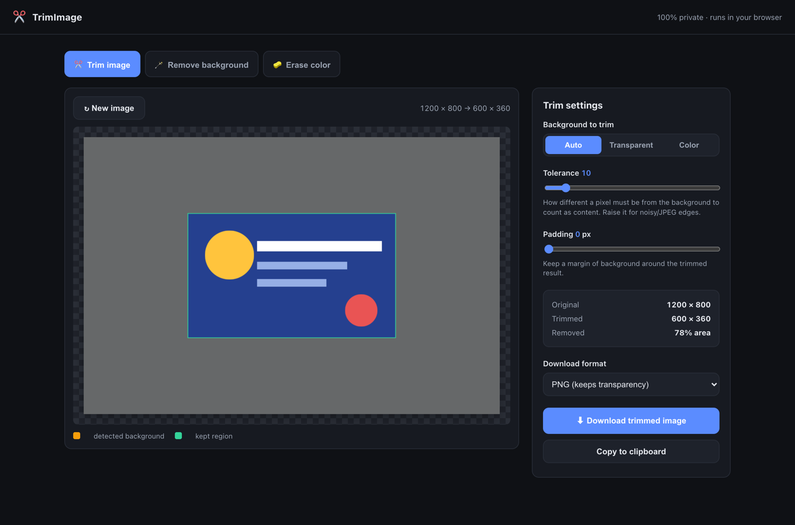
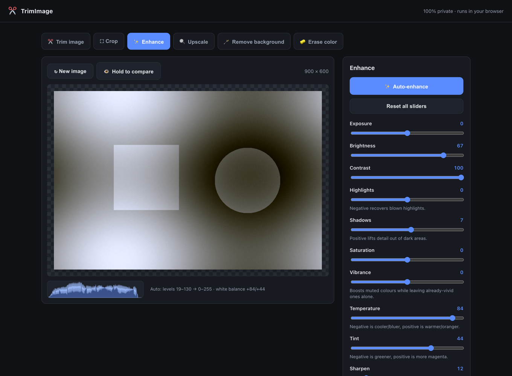
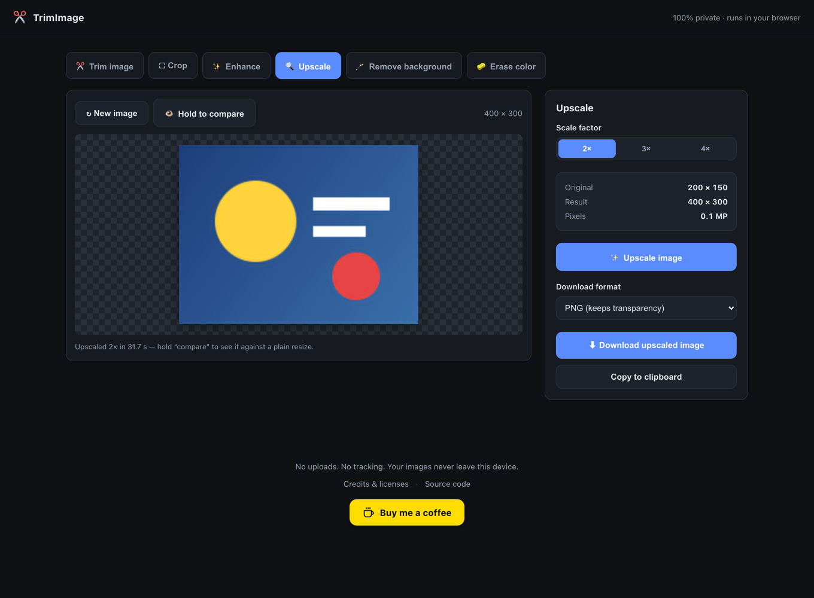
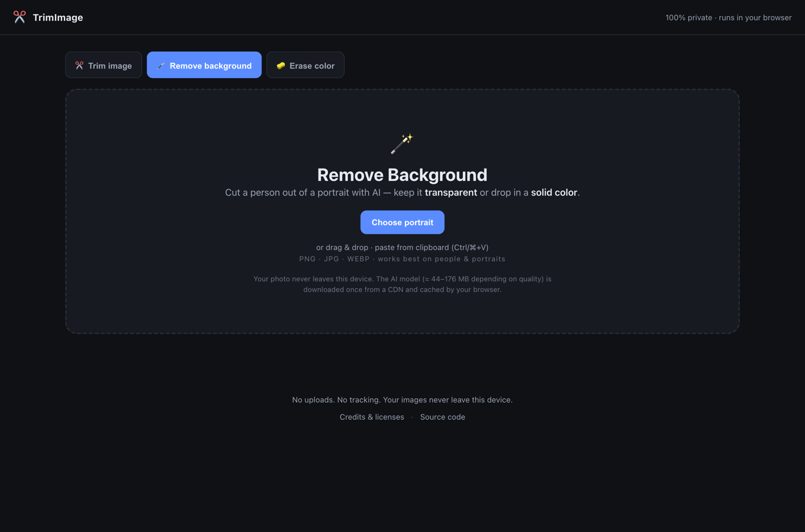
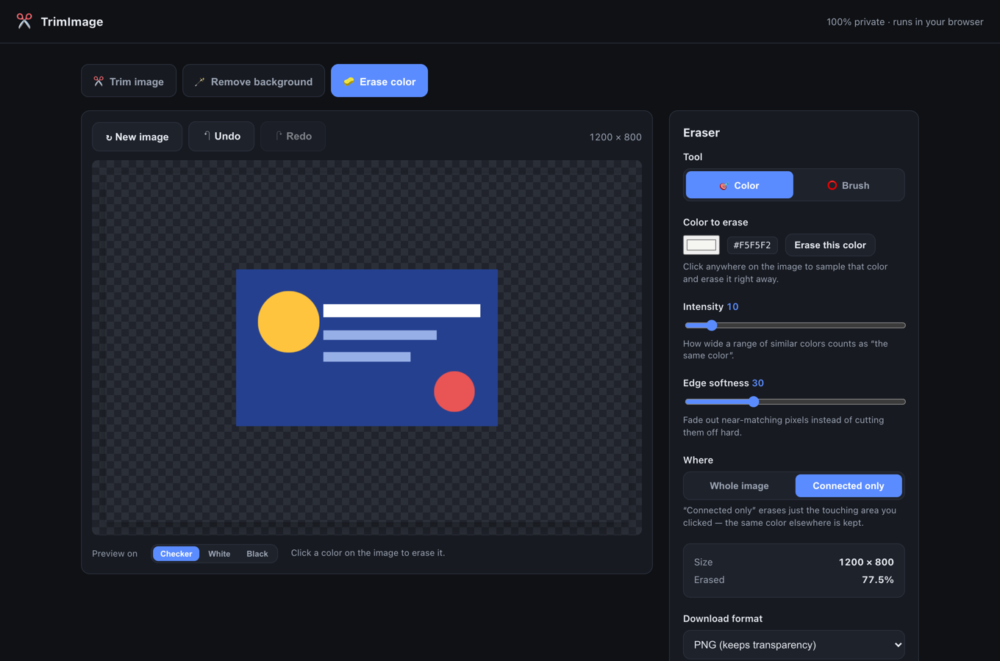

# ✂️ TrimImage

Six image tools that run **entirely in your browser** — trim empty space, crop to any aspect ratio,
auto-enhance colour and exposure, upscale with AI, remove a portrait's background, or erase a colour
into transparency. No uploads, no accounts, no server.

**Live at [imagetrimmer.com](https://imagetrimmer.com)**

[](LICENSE)


---

## Tools

### ✂️ Trim image
Crops away the uniform border around an image — the equivalent of Photoshop's *Image → Trim*.



- **Auto** background detection (samples the four corners), or trim by **transparency** or a **specific colour**
- **Eyedropper** to pick the background colour straight off the image
- **Tolerance** slider for noisy or JPEG-compressed edges
- **Padding** to keep a margin around the result
- Live preview of the crop, with original/trimmed/removed stats
- Export as PNG, JPG or WEBP, or copy to clipboard

### ⛶ Crop
Draw a selection and cut it out — pixel exact.

- Drag to draw, drag inside to move, **8 handles** to resize — everything clamped to the image
- **Aspect ratio presets** — Free, Original, 1:1, 4:3, 3:2, 16:9, 3:4, 2:3, 9:16 — held through every resize
- **Numeric W/H/X/Y inputs** for exact values, plus *Select all* and *Center 80%*
- **Rotate** 90° either way and **flip** horizontally or vertically
- Rule-of-thirds guides, arrow-key nudging (Shift for 10 px), Esc to reset
- Export as PNG, JPG or WEBP, or copy to clipboard

### ✨ Enhance
Auto-fix exposure and colour in one click, then fine-tune by hand.



- **Auto-enhance** reads the histogram: stretches the 1–99% levels to full range and applies a
  two-axis grey-world white balance (temperature *and* tint), then sets the sliders so you can tweak the result
- 11 adjustments — exposure, brightness, contrast, highlights, shadows, saturation, vibrance,
  temperature, tint, sharpen, vignette
- Live **histogram**, hold-to-compare against the original, reset
- Sliders drive a downscaled proxy for instant feedback; downloads re-run the same pipeline at full resolution

### 🔍 Upscale
AI super-resolution — enlarge 2×, 3× or 4× with sharper results than a plain resize.



- ESRGAN/RDN model via UpscalerJS on TensorFlow.js, running on your GPU through WebGL
- Model is only **~3 MB**, downloaded once and cached by the browser
- Patch-by-patch with a live progress bar, and **cancellable** mid-run
- **Hold to compare** against a plain high-quality resize at the same size
- Guards against absurd output sizes, and warns before slow runs

### 🪄 Remove background
AI portrait cutout, running locally on your device. Keep the result transparent or drop in a solid colour.



- Segmentation with the **IS-Net** model via ONNX Runtime — **WebGPU** when available, WebAssembly otherwise, with automatic fallback
- **Transparent** or **solid colour** background, with 10 presets (incl. passport blue) plus a custom colour picker
- **Shrink edge** to remove leftover fringe from the old background, **feather edge** to blend into the new one
- **Server or in-browser** — server mode needs no download (good on mobile data); in-browser mode uploads nothing
- Three quality tiers (44 / 88 / 176 MB models) for the in-browser path, with a **consent prompt showing the exact size** before any download
- **Hold to compare** against the original
- Export as PNG, JPG or WEBP, or copy to clipboard

> The photo never leaves your device — only the model travels, and it travels *to* you.

### 🧽 Erase colour
Click a colour to make it transparent, or wipe pixels away by hand with a round eraser.



- **Click to sample** any colour and erase it instantly
- **Intensity** controls how wide a range of similar colours counts as "the same colour" — re-tunable live, without stacking mistakes
- **Edge softness** fades near-matching pixels instead of cutting hard, which keeps anti-aliased logos clean
- **Whole image** or **connected only** (flood fill) — erase one region and keep the same colour elsewhere
- **Round brush** with size and hardness, plus a **restore** mode to paint erased pixels back in
- Full **undo/redo** (⌘/Ctrl+Z, ⌘/Ctrl+⇧+Z), checker/white/black preview backgrounds
- Export as PNG or WEBP, or copy to clipboard

---

## Privacy

**Trim, Crop, Enhance, Upscale and Erase colour never upload anything** — they process pixels locally
with the canvas API, and the ~3 MB upscaling model runs on your device.

**Remove background** lets the user choose, in the tool itself:

- **On our server** (default when the API is deployed) — the photo is uploaded over HTTPS, the cutout is
  computed, and the image is discarded as soon as the response is sent. Never written to disk, never
  logged, and the response carries `Cache-Control: no-store`. This exists so people on mobile data don't
  have to download a 44–176 MB model.
- **In my browser** — nothing is uploaded. The model downloads once, with the size shown up front so the
  user can decline, and everything runs locally.

If the API isn't deployed, the UI detects that and silently uses the in-browser path. No accounts, no
analytics, no tracking cookies, either way.

---

## How it works

**Trim** reads the image into an offscreen canvas, picks a reference background colour (corner average,
alpha, or a chosen colour), then scans inward from each edge for the first row/column containing a pixel
whose weighted RGB distance from that reference exceeds the tolerance. The result is a tight content
bounding box, expanded by the padding value.

**Remove background** hands the decoded pixels straight to the model as a raw RGBA buffer (no PNG
round-trip). The network runs at 1024×1024 internally; the resulting alpha mask is bilinearly upscaled
back to full resolution, then refined:

- *Shrink* is a separable running-minimum erosion (van Herk / Gil-Werman), **O(1) per pixel** regardless of radius
- *Feather* is two passes of a separable box blur, approximating a gaussian

**Enhance** bakes every per-channel operation (exposure, highlights/shadows, contrast, brightness,
temperature, tint) into three 256-entry lookup tables, so the hot loop is three array reads per pixel;
only saturation/vibrance, vignette and the unsharp mask need real per-pixel work. *Auto-enhance* reads
the luma histogram, stretches the 1–99% range to full scale, and solves the grey-world white balance
across **both** colour axes — correcting only red/blue balances those two channels but leaves green
behind, turning a blue cast into a magenta one.

**Upscale** runs the model patch by patch with `awaitNextFrame`, which keeps the progress bar painting
and the run cancellable instead of freezing the tab.

**Erase colour** keeps an 8-bit alpha multiplier per pixel, so every operation is non-destructive and
undoable — the source image is never modified. Colour erasing compares squared RGB distance against
inner/outer thresholds derived from intensity and softness, with an early-out on the common case.
"Connected only" is a scanline flood fill. Brush strokes are interpolated along the drag path and
composited through a dirty-rect so only the touched region is repainted.

### Measured performance

On a 12 MP (4000×3000) image:

| Operation | Time |
|---|---|
| Colour erase, whole image | ~140 ms |
| Enhance preview frame (1400 px proxy, all sliders) | ~51 ms |
| Enhance full-res export (12 MP, incl. sharpen) | ~590 ms |
| Flood fill (connected only) | ~125 ms |
| Brush stroke | ~1 ms per pointer move |
| Mask erode / feather | ~120 ms |

Background removal depends on hardware and quality tier — roughly 7–8 s for the *Fast* model on WebGPU,
plus the one-time model download.

---

## Run locally

No build step, no dependencies to install — it's static files. Serve the folder over HTTP (needed so the
browser will load the ES modules and the model):

```bash
git clone https://github.com/jakirseu/trim_image.git
cd trim_image
python3 -m http.server 8000
# open http://localhost:8000
```

Opening `index.html` directly via `file://` mostly works, but the **Remove background** tab needs HTTP.

## Deploying

Static files on any host — the app is fully functional with no backend.

Optionally deploy [`server/`](server/README.md), a small FastAPI + onnxruntime service
that does background removal server-side, so phones skip the 44–176 MB model download.
It uses only permissively licensed pieces (onnxruntime MIT, IS-Net weights MIT), so
**no AGPL code runs on your server**. If it isn't deployed, the front end detects that
and silently uses the in-browser path.

**→ [DEPLOY.md](DEPLOY.md)** has the full walkthrough: install, model fetch, systemd
unit, nginx block and verification.

## Project structure

| File | Purpose |
|---|---|
| [`index.html`](index.html) | App shell, tab bar, and the three tool panels |
| [`app.js`](app.js) | Tab switching + the Trim tool |
| [`crop.js`](crop.js) | Crop selection, aspect ratios, rotate/flip |
| [`enhance.js`](enhance.js) | Tone/colour adjustments, auto-enhance, histogram |
| [`upscale.js`](upscale.js) | AI super-resolution (UpscalerJS + TensorFlow.js) |
| [`server/`](server/) | Optional background-removal API (FastAPI + onnxruntime) — see its [README](server/README.md) |
| [`bgremove.js`](bgremove.js) | AI background removal (model loading, mask refinement, compositing) |
| [`eraser.js`](eraser.js) | Colour eraser, flood fill, brush, undo/redo |
| [`styles.css`](styles.css) | All styling |
| [`credits.html`](credits.html) | Credits & licenses page |

## Browser support

Needs a modern browser with Canvas 2D and ES module support. WebGPU is used for background removal
when the browser exposes it, and falls back to WebAssembly automatically. Clipboard copy requires
`ClipboardItem` support.

---

## Credits

Full attribution lives on the [credits page](credits.html). **Trim**, **Crop**, **Enhance** and
**Erase colour** use no third-party code. The two AI tools build on:

| Component | Author | License |
|---|---|---|
| [@imgly/background-removal](https://github.com/imgly/background-removal-js) v1.7.0 | IMG.LY GmbH | AGPL-3.0 |
| [IS-Net (DIS)](https://github.com/xuebinqin/DIS) segmentation model | Xuebin Qin et al. | MIT |
| [ONNX Runtime Web](https://github.com/microsoft/onnxruntime) v1.21.0 | Microsoft | MIT |
| [UpscalerJS](https://github.com/thekevinscott/UpscalerJS) v1.0.0 + its ESRGAN "medium" model | Kevin Scott | MIT |
| [TensorFlow.js](https://github.com/tensorflow/tfjs) v4.11 | Google & contributors | Apache-2.0 |
| [ndarray](https://github.com/scijs/ndarray) · [lodash-es](https://lodash.com/) · [zod](https://github.com/colinhacks/zod) | respective authors | MIT |

The segmentation model comes from *Highly Accurate Dichotomous Image Segmentation* (Qin et al., ECCV 2022).

## License

Licensed under the **[GNU AGPL v3](LICENSE)**.

TrimImage depends on `@imgly/background-removal`, which is AGPL-3.0, so the combined work is AGPL-3.0
as well. In practice that means anyone running this over a network must offer their users the complete
corresponding source — which is what this repository is for.

If you want to build on this without that obligation, IMG.LY sells commercial licenses for the
background-removal library (<support@img.ly>); the model itself and ONNX Runtime are permissively licensed.
